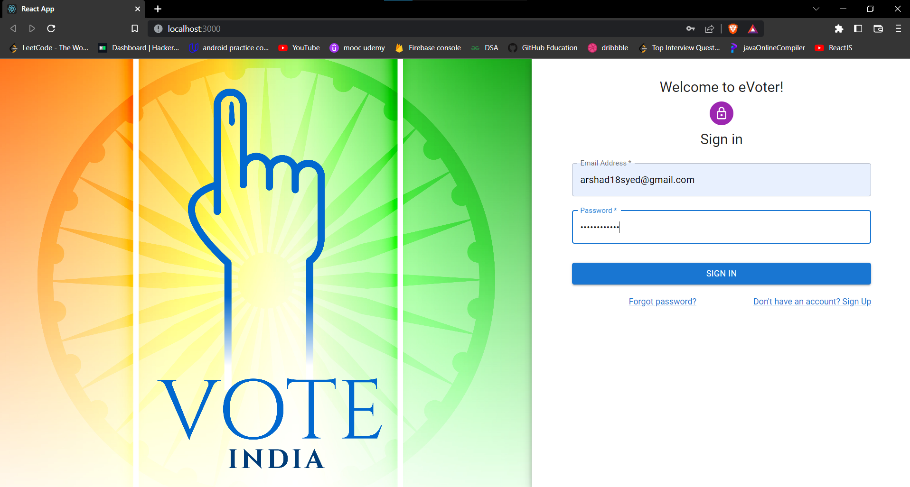
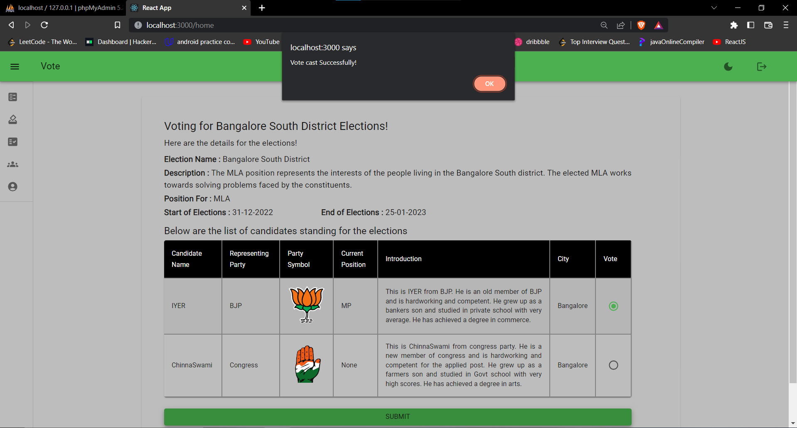
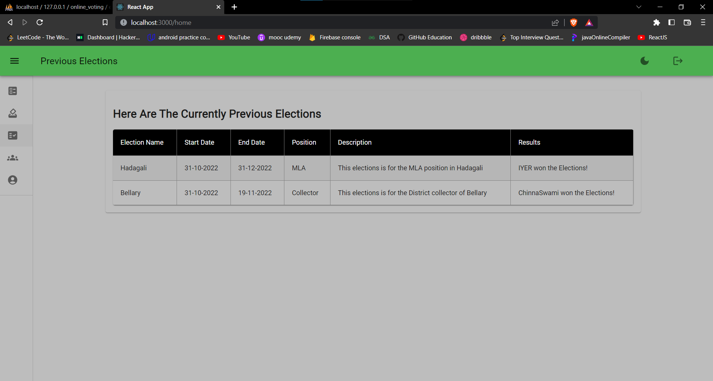
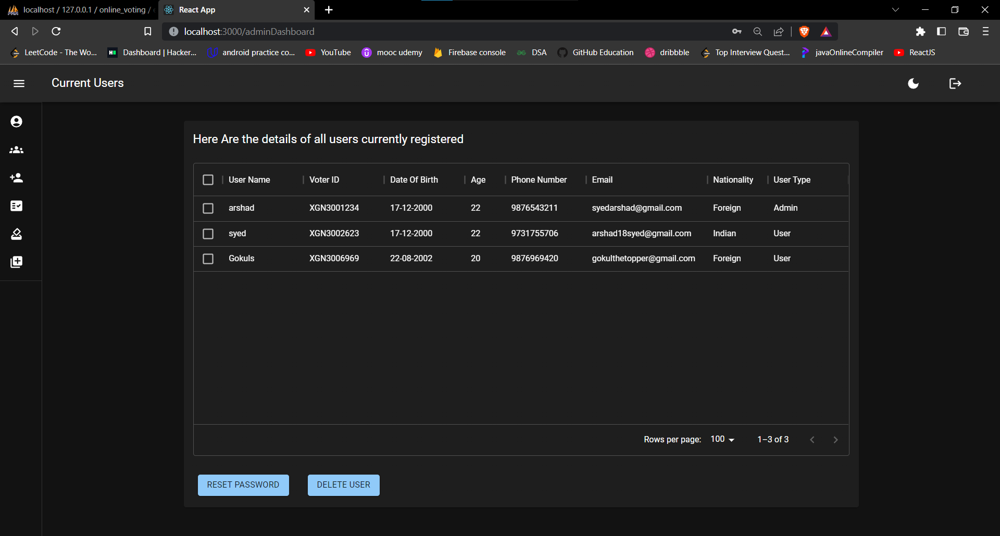
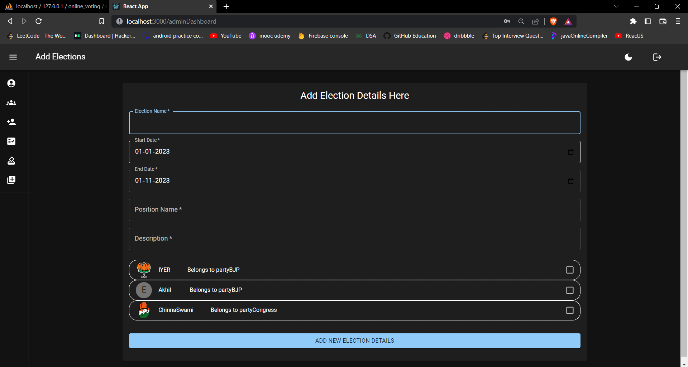

# eVoter - Elections ReImagined

The eVoter project is an online platform for voting and managing elections. It aims to increase accessibility and convenience for voters by allowing them to cast their votes online, rather than having to physically go to a polling station.

Estonia is widely regarded as a pioneer in the use of online voting systems, having implemented electronic voting in 2005 and expanded its use in subsequent elections. Despite the success of Estonia's online voting system, relatively few other countries have attempted to implement similar systems.

## Features

- User registration using voter IDs and login
- Voting in active elections
- Viewing previous and upcoming elections
- Results of completed elections
- Viewing Candidate information
- Admin can check and approve voters based on the information they provided
- Admin can create election polls and view vote progress and results
- Admin cannot view user's vote choices or change the votes or the results as these permissions are locked from admin

## Focus on Security and Integrity

In addition to these core functions, the eVoter project will also prioritize the security and integrity of the voting process, as well as the confidentiality of individual votes. These issues are critical to the success and credibility of any online voting system, and will be carefully considered in the design and implementation of the eVoter platform.

## Technology Used

The eVoter project uses React, Node.js, Express, and MySQL.
Additionaly this project uses Xampp for SQL support

## Installation

To run eVoter locally, follow these steps:

1. Clone the repository:
  git clone https://github.com/arshad-syed18/eVoter.git

2. Install dependencies: 
  cd client  
  npm i 
  cd ../server 
  npm i 
  cd .. 
  
4. Import the sql code dump or create the tables with given structure

3. Start the server: 
  npm run devStart 
4. Start the client: 
  npm start 
  
 
## Screenshots

Here are some screenshots of the eVoter platform:

### Login Page

This is the login page for the eVoter platform.

### Voting Page

This screenshot shows a user voting in an active election.

### Results Page

This screenshot shows the results of a previous election.

### Admin Users Page

This screenshot shows the admin page for checking user details.

### Admin Add Election Page

This screenshot shows the admin page for adding elections and selecting candidates.

